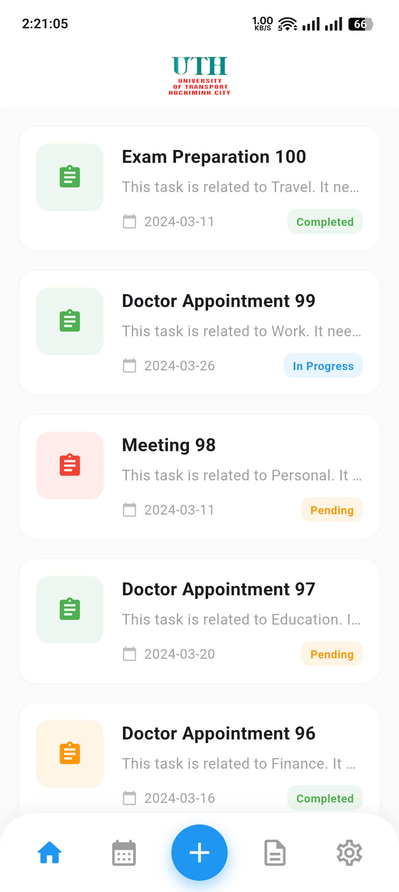
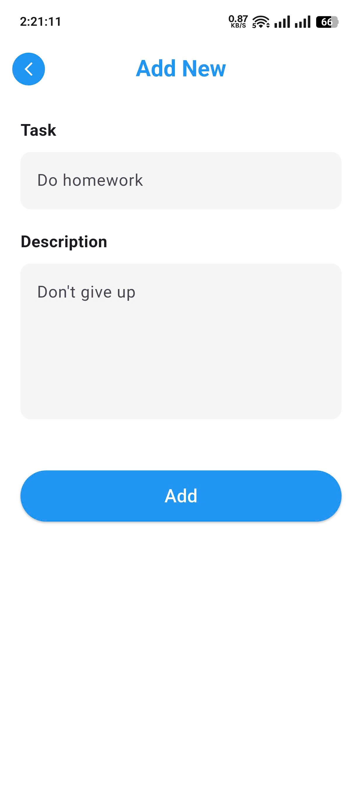
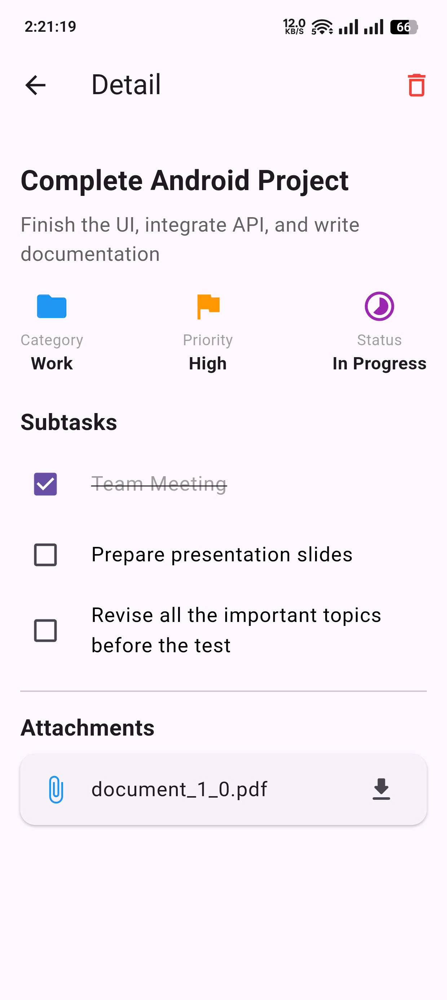

# UTH SmartTasks 📝

**UTH SmartTasks** là ứng dụng quản lý công việc (To-Do List) hiện đại, được xây dựng bằng **Flutter**. Ứng dụng áp dụng kiến trúc **MVVM**, hỗ trợ **Offline-first** (hoạt động khi không có mạng) và đồng bộ dữ liệu thông minh.


## 📸 Screenshots

| Màn hình chính (Home) | Tạo Task mới (Add) | Chi tiết (Detail) |
|:---:|:---:|:---:|
|  |  |  |

## ✨ Tính năng chính

* **Đăng nhập Google:** Xác thực người dùng nhanh chóng qua Firebase Auth.
* **Offline-First:** Sử dụng **SQLite (Sqflite)** để lưu trữ dữ liệu cục bộ. App vẫn hoạt động mượt mà khi tắt mạng.
* **Quản lý Task:**
    * Xem danh sách công việc theo thẻ màu (dựa trên danh mục).
    * Thêm công việc mới.
    * Xem chi tiết công việc.
    * Xóa công việc.
* **Giao diện hiện đại:** UI được thiết kế sạch sẽ, trực quan.
* **Profile:** Xem thông tin người dùng và Đăng xuất.

## 🛠 Tech Stack

* **Framework:** Flutter
* **Ngôn ngữ:** Dart
* **Kiến trúc:** MVVM (Model - View - ViewModel)
* **State Management:** Provider
* **Local Database:** Sqflite (SQLite)
* **Authentication:** Firebase Auth & Google Sign-In
* **Networking:** Http (Kết nối REST API mock)

## 📂 Cấu trúc thư mục

```text
lib/
├── models/                # Các class dữ liệu (Task)
├── view_models/           # Logic nghiệp vụ (TaskViewModel)
├── services/              # Các dịch vụ bên ngoài (AuthService)
├── views/
│   ├── screens/           # Các màn hình chính (Home, Detail, Create...)
│   └── widgets/           # Các widget tái sử dụng (TaskItem...)
└── main.dart              # Khởi chạy ứng dụng & Cấu hình Provider
```

## 🚀 Cài đặt & Chạy dự án
**1. Yêu cầu**

Flutter SDK

Android Studio / VS Code

Máy ảo Android hoặc thiết bị thật.

**2. Clone dự án**

    git clone https://github.com/HPhi1808/ToDoList.git
**3. Cài đặt thư viện**

    flutter pub get
**4. Cấu hình Firebase (Quan trọng)**

Dự án sử dụng Firebase Auth, bạn cần tự tạo project Firebase của riêng mình:

- Truy cập Firebase Console.

- Tạo project mới.

- Thêm ứng dụng Android với package name: com.example.to_do_list (tên trong AndroidManifest.xml).

- Kích hoạt Authentication -> Google Sign-In.

- Tải file google-services.json và đặt vào thư mục: android/app/google-services.json

**5. Chạy ứng dụng**

    flutter run
## 🧠 Logic hoạt động (Offline First)
Khi mở App: SplashScreen kiểm tra FirebaseAuth. Nếu đã đăng nhập -> vào Home. Nếu chưa -> vào Onboarding/Login.

***Tại Home:***

TaskViewModel được gọi.

Nó lấy dữ liệu từ SQLite hiển thị lên UI ngay lập tức (không chờ mạng).

Sau đó, nó gọi API ngầm. Nếu có dữ liệu mới, nó cập nhật vào SQLite và refresh UI.

***Khi Thêm/Xóa:***

Dữ liệu được cập nhật ngay vào SQLite và UI.

Logic đồng bộ lên Server được thực hiện ngầm (hiện tại là Mock API).